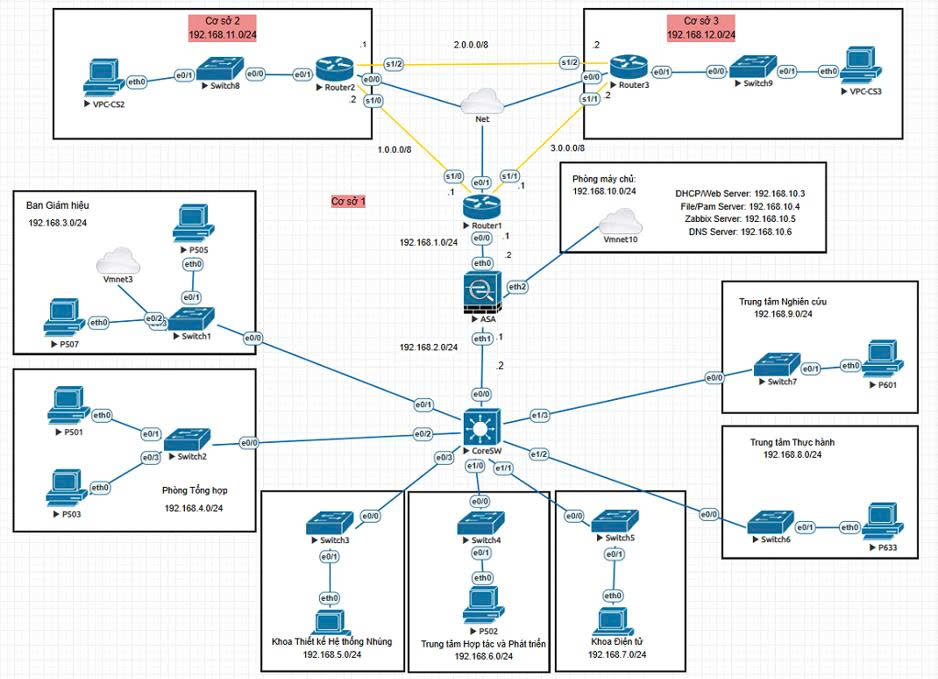
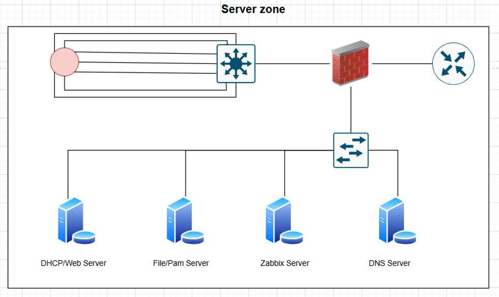
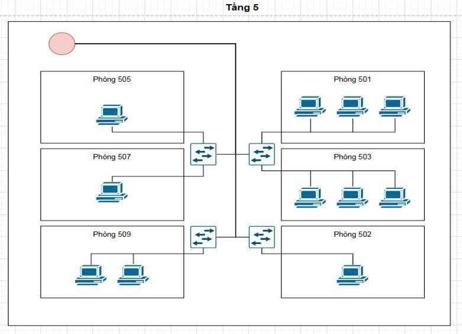
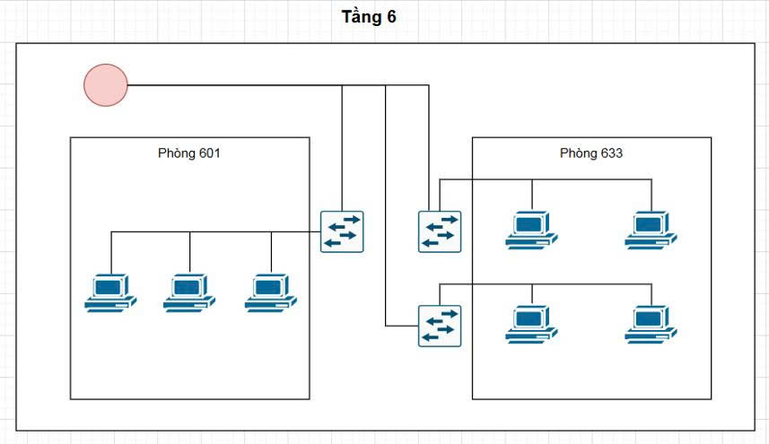
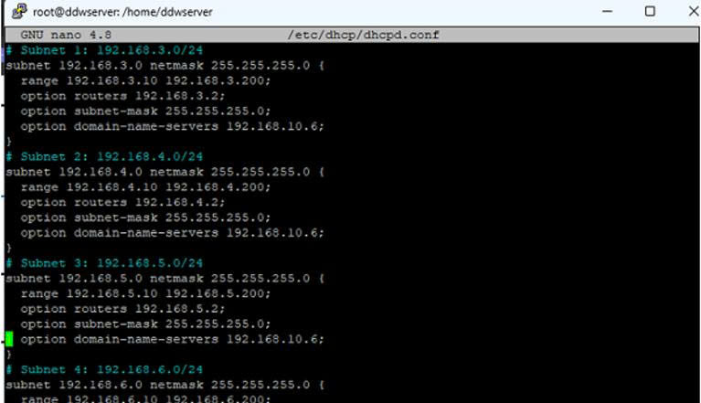
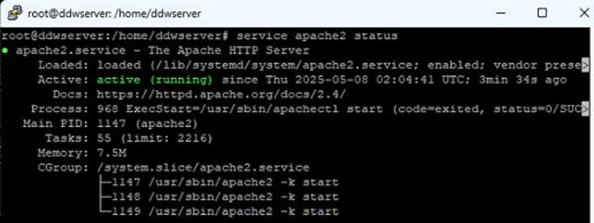
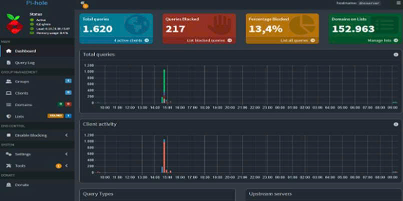
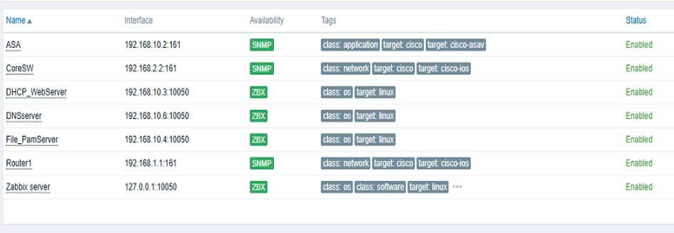
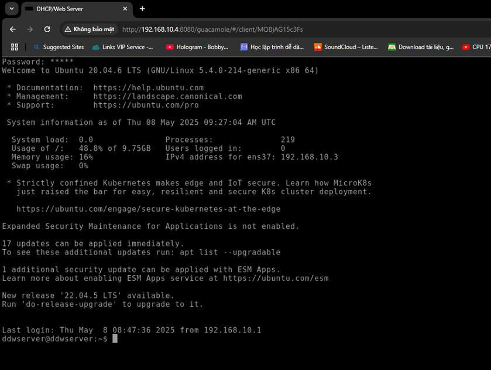

# 🖥️ Hệ thống Quản trị Mạng Linux cho Khoa Điện tử

> Đồ án tốt nghiệp – Đại học Công nghiệp Hà Nội (HaUI)

## 📌 Giới thiệu
Dự án mô phỏng và triển khai hệ thống quản trị mạng doanh nghiệp trên **EVE-NG**, kết hợp thiết bị Cisco và các dịch vụ Linux nhằm xây dựng hạ tầng mạng an toàn, ổn định, dễ quản trị và dễ mở rộng.

## 🏗️ Kiến trúc hệ thống

### Sơ đồ tổng quan


### Sơ đồ vật lý phòng máy chủ


### Sơ đồ vật lý tầng 5


### Sơ đồ vật lý tầng 6


## 🛠️ Các dịch vụ máy chủ Linux

| Dịch vụ | Công nghệ | Vai trò |
|---|---|---|
| DHCP Server | isc-dhcp-server | Cấp phát IP theo VLAN |
| DNS Server | Pi-hole | DNS nội bộ, chặn quảng cáo |
| PAM | Apache + Guacamole | SSH/RDP qua Web, MFA |
| File Server | Samba | Chia sẻ dữ liệu, phân quyền |
| Monitoring | Zabbix 7.2 | Giám sát và cảnh báo Telegram |
| Database | MariaDB + phpMyAdmin | Lưu trữ dữ liệu |
| Web Server | Apache2 | Website Khoa Điện tử |

## 🌐 Thiết kế địa chỉ IP

| Thiết bị | IP | Gateway |
|---|---|---|
| Cisco ASA | 192.168.10.2 | - |
| DHCP/Web | 192.168.10.3 | 192.168.10.2 |
| File/PAM | 192.168.10.4 | 192.168.10.2 |
| Zabbix | 192.168.10.5 | 192.168.10.2 |
| Pi-hole | 192.168.10.6 | 192.168.10.2 |

## 💻 Công nghệ sử dụng

- EVE-NG
- Cisco IOS / Cisco ASA
- Ubuntu Server
- OSPF
- VLAN
- ISC DHCP Server
- Pi-hole
- Samba
- Apache2
- Apache Guacamole
- MariaDB
- phpMyAdmin
- Zabbix
- Telegram Bot

## 📂 Cấu trúc dự án

```text
Linux-Network-Management-System
├── configs/
│   ├── ASA.txt
│   ├── CoreSW.txt
│   ├── Router1.txt
│   ├── Router2.txt
│   └── Router3.txt   
├── docs/
│   ├── Bao-Cao-Do-An.pdf
├── topology/
│   ├── DATN.unl
│   ├── so-do-tong-quan.jpg
│   ├── phong-may-chu.jpg
│   ├── so-do-vat-ly-tang-5.jpg
│   └── so-do-vat-ly-tang-6.jpg
├── screenshots/
└── README.md
```

## 🚀 Chức năng nổi bật

- Phân chia VLAN và định tuyến OSPF.
- Bảo vệ mạng bằng Cisco ASA Firewall.
- DHCP cấp phát IP tự động.
- DNS nội bộ với Pi-hole.
- Samba File Server tích hợp Active Directory.
- Giám sát hệ thống bằng Zabbix.
- Cảnh báo qua Telegram.
- Quản trị từ xa qua Guacamole (SSH/RDP, MFA).
- Website nội bộ bằng Apache2.
# 📸 Hình ảnh hệ thống


## DHCP-Config



## DHCP-Working



## DNS



## Web Server


## Zabbix



## SSH



# ⚙️ Cấu hình

Các file cấu hình của Router, Switch và Firewall được lưu trong thư mục `configs/`.

---

# 🧪 File Lab

File mô phỏng EVE-NG:

```text
topology/DATN.unl
```

---

# 📄 Báo cáo

Báo cáo đầy đủ nằm trong thư mục `docs/`.

---


## ✅ Kết quả đạt được

- Xây dựng thành công mô hình mạng nhiều VLAN.
- Các dịch vụ Linux hoạt động ổn định.
- Hệ thống giám sát và cảnh báo hoạt động tốt.
- Mô hình có thể mở rộng và áp dụng cho môi trường doanh nghiệp.

## 🔮 Hướng phát triển

- VPN Site-to-Site.
- High Availability.
- Tự động sao lưu cấu hình.
- Giám sát nâng cao và Dashboard.

## 👨‍💻 Tác giả

**Đỗ Quốc Khởi**  
Chuyên ngành mạng máy tính và truyền thông dữ liệu
Đại học Công nghiệp Hà Nội
